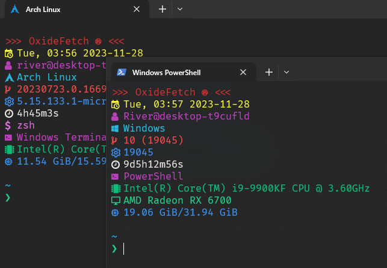

# oxidefetch 1.2.0
Fully cross platform Neofetch clone written in Rust. Up to 25 times faster than Neofetch!  

  

### Why Oxidefetch?
Neofetch, being a BASH script, has a few downsides in my opinion.  
1: It's slow.  
2: It only works on platforms which have the BASH shell.  
3: It's kinda big, and I like having more compact info.  
As such, I wrote OxideFetch. How cool is that? It displays your information in a manner that's compact, and BLAZINGLY fast. 
I've measured speeds of up to 25 times faster than normal Neofetch on WSL2.

### Features  
OxideFetch can display all of the following information:  
- Date, time, and day of week  
- Username and hostname  
- Operating system name, symbol, and matching color  
- Kernel version  
- Uptime  
- Shell  
- CPU  
- GPU  
- Memory  

### Installation  
Download a binary for your platform, and place it in your PATH.  
Currently, only Windows (x86) and Linux (x86) have binaries available. If you want a binary for another platform, you will have to follow the instructions to build from source.

### Dependencies 
#### Build/Install
To build Oxidefetch, you need Cargo. You can use Cargo to automatically build and install it like so:
```cargo install --git https://github.com/shibedrill/oxidefetch```.  
From there, it *should* be in your PATH. If not, add ```source ~/.cargo/env``` to your profile, or add ```~/.cargo/bin``` to your $PATH. If you do not already have Cargo installed 
on your system, you can do so by installing Rustup- either via the [instructions on their website](https://doc.rust-lang.org/cargo/getting-started/installation.html "instructions on their website") or via your system package manager.
#### Runtime
There's only a couple runtime dependencies for this project.  
1: ```sh``` shell installed for GPU detection on *nix systems.  
2: ```lspci``` installed for GPU detection on *nix systems.  
(If either of these above dependencies are absent, chances are the GPU field will simply not show up. It won't crash or anything.  
GPU detection runs on Windows without any dependencies.)  
3: Nerd fonts symbols are used in the output. Install a patched font on  your system, or patch an already installed font.

### How you can help with the project
I need to verify the output of the OS information detection libraries I'm pulling in. To do this, I need the help of people 
with varying types of systems. I've tested Arch Linux and Windows 10, but nothing else. To help, you can kindly clone this 
repo, and inside the folder, run ```cargo test -- --nocapture```, and send the resultant ```test_output.txt``` file to my 
noreply email address, or directly to me on Discord at ```Shibe Drill#9730```. This program does NOT collect information 
regarding your real name, IP, location, etc. You can look at the file it generates to be sure- it's all plaintext, babey.

### Bugs, Quirks, Unintended Behavior, And Other Shenanigans   
Quirk: Depending on the amount of colons present in the `lspci` output, the GPU fields might display incorrectly. Proposed fix is to use `cut -d "VGA compatible controller: "` to trim the output of `lspci`.  
Quirk: Multiple GPUs will display strangely. Proposed fix is to replace newlines with a comma.  

### To Do & Roadmap   
#### Semi-urgent fixes:   
- Fix display of GPU info on systems with multiple GPUs
#### Very near future:   
- Add support for user configurability for entries (whether or not an entry shows, its color, units for memory and time)   
- Add process count detection  
- Refactor logic for cleaner code   
- **[Complete as of 1.1.2]** Switch from `bash` to `sh` to run the GPU detection command, if possible, since `sh` is installed on every *nix system by default  
#### Future:  
- Add host system name detection such as "Windows Subsystem for Linux", "IdeaPad 3", "Dell Optiplex", etc.  
- Add package count/package manager detection  
- Crosstest on more distributions to verify `sys.name()` outputs  
#### Distant future:  
- Add terminal emulator detection by walking up the process tree  
- More extensible user configuration for entry formatting  

### Changelog
**1.0.0:** Official full stable release   
**1.0.1:** Fixed distro name for Debian GNU/Linux. Logo & color works now.  
**1.1.0:** Refactored some poorly written typing, and added support for memory.  
**1.1.1:** Made sure that linux system detection won't fail if Linux has a capital L.  
**1.1.2:** Replaced *nix dependency on ```bash``` with dependency on ```sh```.  
**1.2.0:** Allowed users to enable field titles as a compile-time feature. Tentative fix for GPU display issues on Linux.
